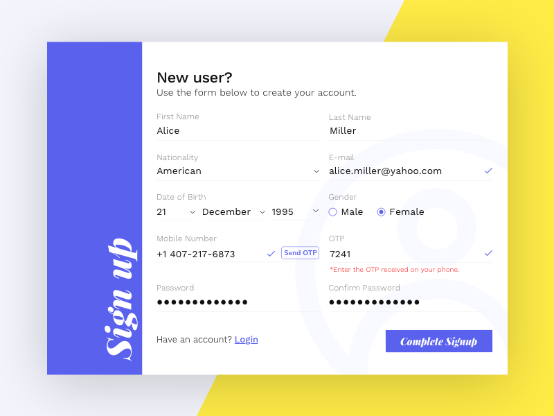

## VueJS VeeValidate Signup form
A simple [VueJS](https://github.com/vuejs)/[VeeValidate](https://github.com/baianat/vee-validate) signup form built with [Bulma](https://github.com/jgthms/bulma) CSS

 

## Preview
[See the form in action](https://codepen.io/mauritiusdsilva/pen/RJqLdq)

 
 

## Design Mockup
If you wish to download the sketch source file [Download it here](http://bit.ly/slfrm)
 

  

